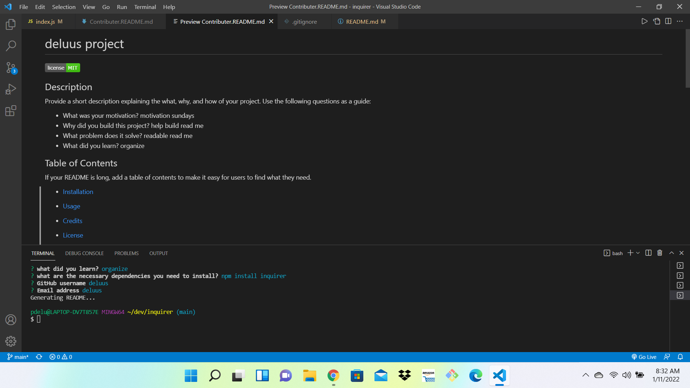

# Read Me Generator

- what information will i need for the content of the Read Me?
Project title
- Sections
  -description
  -table of contents
  -installation instructions
  -usage inforamtion
  -list of contributors
  -guidlines 
  -testing instructions

Create a .gitignore file and include node_modules/ and .DS_Store/ so that your node_modules directory isn't tracked or uploaded to GitHub. Be sure to create your .gitignore file before installing any npm dependencies.

Make sure that your repo includes a package.json with the required dependencies. You can create one by running npm init when you first set up the project, before installing any dependencies.

Include a video of the typical user flow through your application. This includes views of the prompts and the responses after their selection.

Include any other screenshots you deem necessary to help someone who has never been introduced to your application understand the purpose and function of it. This is how you will communicate to potential employers or other developers in the future what you built and why, and to show how it works.

video:
 https://watch.screencastify.com/v/N4Zw3Me4jeLEqyVPqqRI
 

screensshot :

github:

deploy link:
